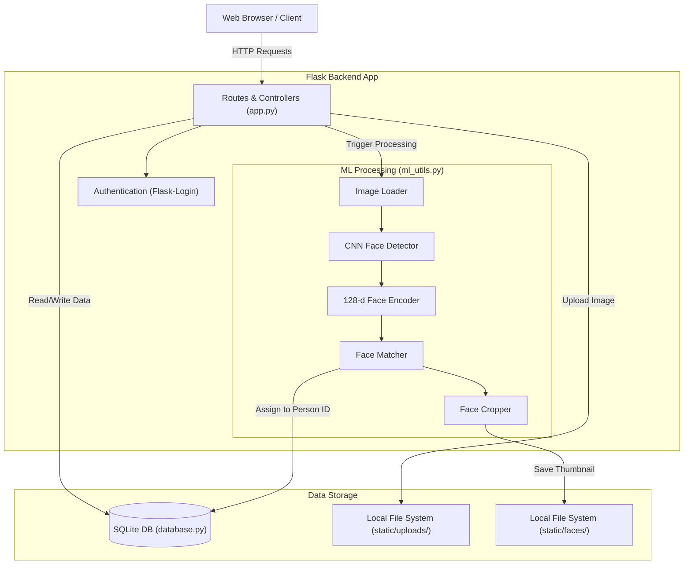

# Image Flow - AI Powered Photo Classification and Management System


Image Flow is a full-stack web application designed to help users organize messy collections of photos. By leveraging advanced Machine Learning (specifically Facial Recognition), the system automatically detects faces within uploaded images, groups them by identity, and categorizes them into organized folders. It ensures user privacy by sandboxing data and provides features like secure sharing and intuitive folder management.

---

## 🚀 Features

- **Automated Face Detection & Grouping:** Upload raw photos, and the ML pipeline will automatically detect faces, crop them, and group them by person.
- **Private Sandboxing:** User data is strictly isolated. You only see and process your own photos.
- **Secure Public Sharing:** Generate public share links for specific people/folders to share with friends and family without needing an account.
- **Folder Management:** Rename people, view original photos, and delete folders (which cascadingly removes all associated raw files to save space).

---

## 🏗️ System Architecture

The application is built on a modern MVC architecture with a background-capable ML pipeline.

- **Backend:** Flask (Python 3.10+)
- **Database:** SQLite via SQLAlchemy (easily migratable to PostgreSQL/MySQL)
- **Machine Learning Core:** `face_recognition` (dlib), OpenCV, NumPy, Pillow
- **Frontend:** Jinja2 server-side rendered HTML templates
- **Authentication:** Flask-Login with Werkzeug scrypt hashing

### Architecture Flow



---

## 🛠️ Prerequisites & Installation

Before installing the project, you must ensure your system has the necessary build tools to compile C++ code. The core Machine Learning library (`dlib`) is written in C++ and **requires** compilation on Windows.

### 1. Install C++ Build Tools (Windows Only)
If you are on Windows, you **must** install Visual Studio C++ Build Tools before running `pip install`:
1. Download **CMake**: [https://cmake.org/download/](https://cmake.org/download/). Check the box: **"Add CMake to the system PATH"** during installation.
2. Download **Visual Studio Build Tools**: [https://visualstudio.microsoft.com/visual-cpp-build-tools/](https://visualstudio.microsoft.com/visual-cpp-build-tools/).
3. Run the installer, select the **"Desktop development with C++"** workload, and click Install.
4. Restart your terminal/computer.
*(Note: MacOS and Linux users can skip this step).*

### 2. Python
Ensure you have **Python 3.10, 3.11, or 3.12** installed on your system.

### 3. Setup Project
Clone the repository and set up a virtual environment:

```bash
git clone https://github.com/adhisa-bala-rakshana/photoclass.git
cd photoclass

# Create the virtual environment
python -m venv venv

# Activate it (Windows)
venv\Scripts\activate
# Activate it (Mac/Linux)
source venv/bin/activate

# Install dependencies
pip install -r requirements.txt
```
*(Note: Installation might take a few minutes as `dlib` compiles the C++ code).*

---

## 🏃‍♂️ How to Run

1. Start the Flask web server:
   ```bash
   python app.py
   ```
2. Open your web browser and navigate to:
   ```text
   http://127.0.0.1:5000
   ```

---

## 📖 Usage Guide

1. **Register/Login:** Create a new account or log in.
2. **Upload Photos:** Go to the Dashboard and drag-and-drop your images into the upload zone.
3. **Wait for AI Processing:** The system will process the images to find small faces, extract encodings, and match them.
4. **Manage Folders:** You will see organized folders for every person found. You can rename the folder, click **Share** to generate a public link, or delete it completely.
